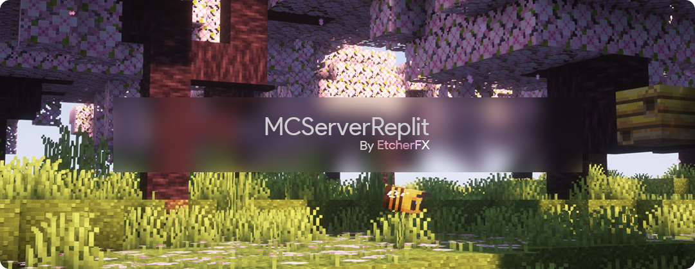
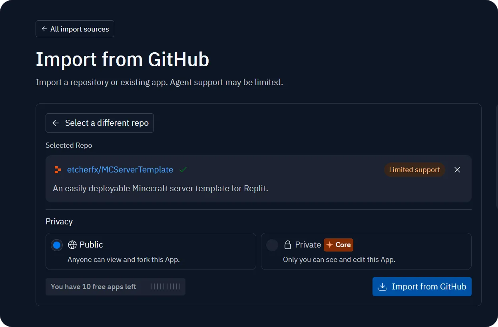
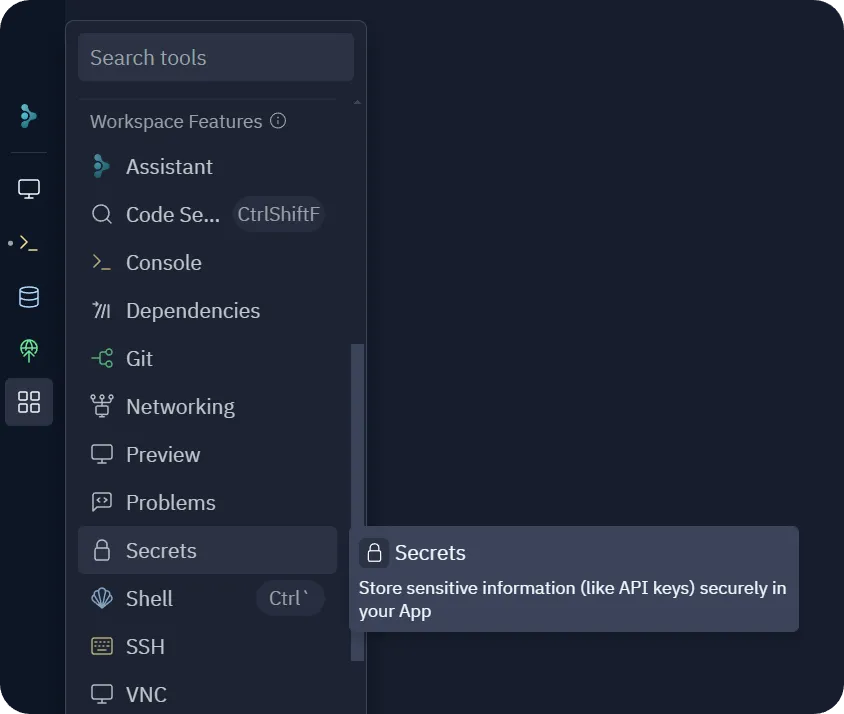

<div align="center">
  
  
  <br>

[](https://www.codefactor.io/repository/github/etcherfx/mcserverreplit/overview/main)
[](https://github.com/etcherfx/MCServerReplit/blob/main/LICENSE)
[](https://github.com/etcherfx/MCServerReplit/issues)
[](https://github.com/etcherfx/MCServerReplit/releases/latest)

**An easily deployable Minecraft server template**

</div>

## 📖 Table of Contents

- [📖 Table of Contents](#-table-of-contents)
- [🔗 Links](#-links)
- [🚀 Deployment](#-deployment)
- [⚙️ Setting Java Versions](#️-setting-java-versions)
- [🔐 Creating Environment Variables](#-creating-environment-variables)
  - [Supported Server Software](#supported-server-software)
  - [Recommended Paper Build Numbers](#recommended-paper-build-numbers)
- [🏃 Running the Server](#-running-the-server)
- [⚡ Server Optimization](#-server-optimization)

## 🔗 Links

- [Releases](https://github.com/etcherfx/MCServerReplit/releases)

## 🚀 Deployment

Navigate to the [import page](https://replit.com/import/github) on Replit and paste the repository URL:

```
https://github.com/etcherfx/MCServerReplit
```

Click on the `Import from GitHub` button



## ⚙️ Setting Java Versions

1. In the files section on replit, click the three dots and hit `Show hidden files`

   

   > **Note:** Sometimes, there might only be a `Hide hidden files` option. In that case, you already have hidden files shown.

2. Navigate to the `replit.nix` file and click on it to open it

   

3. Choose the Java version you want to use from below and replace the default Java version with the one you want to use:

   > **Note:** The default Java version is `pkgs.jdk21_headless`

   | Minecraft Version | Java Version               |
   | ----------------- | -------------------------- |
   | `1.21+`           | `pkgs.jdk21_headless`      |
   | `1.17 - 1.20`     | `pkgs.openjdk17-bootstrap` |
   | `1.16-`           | `pkgs.openjdk8-bootstrap`  |

## 🔐 Creating Environment Variables

1. Click on the `Secrets` button in the tools section on the far left side of your screen

   

2. Click on the `New secret` button

   

3. Create a new secret with the key named `ngrok_token` and the value as your [authtoken](https://dashboard.ngrok.com/get-started/your-authtoken)

   > **Note:** You need to create an ngrok account to get an authtoken

4. Do the same for the variables in the list below:

   | Key       | Value                                                                                                |
   | --------- | ---------------------------------------------------------------------------------------------------- |
   | `SERVER`  | The server software in all lowercase. e.g `purpur`                                                   |
   | `VERSION` | Version of Minecraft your server is running on. e.g `1.19.4`                                         |
   | `BUILD`   | The build number of your server software. _Only use this if you have `paper` as the server software_ |

### Supported Server Software

- [Purpur](https://purpurmc.org/) (1.16.1 and above)
- [Paper](https://papermc.io/) (1.8.8 and above)

### Recommended Paper Build Numbers

| Minecraft Version | Build # |
| ----------------- | ------- |
| `1.21.4`          | `232`   |
| `1.20.6`          | `151`   |
| `1.19.4`          | `550`   |
| `1.18.2`          | `388`   |
| `1.17.1`          | `411`   |
| `1.16.5`          | `794`   |
| `1.15.2`          | `393`   |
| `1.14.4`          | `245`   |
| `1.13.2`          | `657`   |
| `1.12.2`          | `1620`  |
| `1.11.2`          | `1106`  |
| `1.10.2`          | `918`   |
| `1.9.4`           | `775`   |
| `1.8.8`           | `445`   |

> **Tip:** To get a list of all build numbers for paper, visit [PaperMC Downloads](https://papermc.io/downloads/all)

## 🏃 Running the Server

1. Run the repl and follow the instructions on the console
2. Once the console displays `Done! For help, type "help"`, navigate to `status.log` and copy the IP address on `line 7` and enter it inside of Minecraft. The address should be something like `tcp://9.tcp.eu.ngrok.io:46797` and you want to copy IP part, which is the entire address **EXCEPT** the `tcp://` part.

## ⚡ Server Optimization

- Follow [this server optimization guide](https://github.com/YouHaveTrouble/minecraft-optimization) for optimal performance
