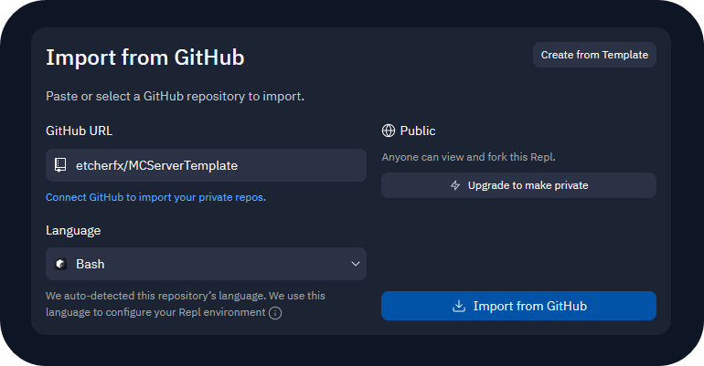
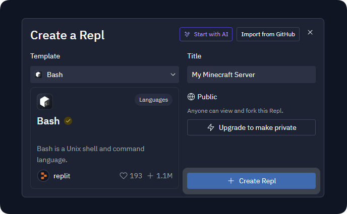
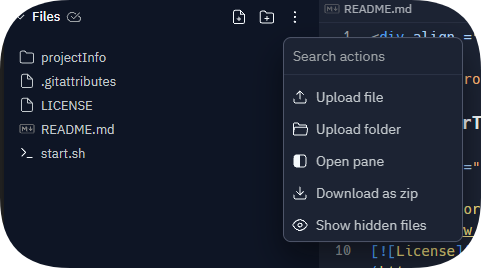
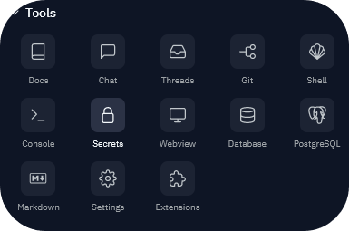
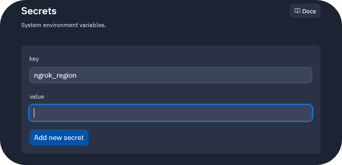
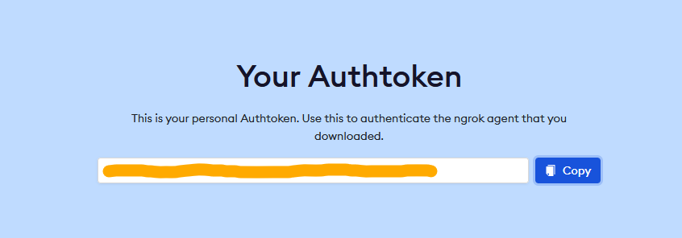

<div align ="center">


# MCServerTemplate

<h3>An easily deployable Minecraft server template.</h3>

</div>

## Links

- [Releases](https://github.com/etcherfx/MCServerTemplate/releases)

## Projects Used

- [Simerlol's Minecraft Server Template](https://replit.com/@SimerLol/Minecraft-Server-Template)

## Deployment

### Automatic method

<a href="https://replit.com/github/etcherfx/MCServerTemplate" target="_blank"></a>

- Open the `Run on replit` button in a new tab and press `Import from Github`

  

### Manual Method

- Create a new `Bash` repl

   

- Type the following commands in order into the shell:
  ```
  git clone https://github.com/etcherfx/MCServerTemplate.git
  ```
  ```
  shopt -s dotglob
  ```
  ```
  mv MCServerTemplate/* MCServerTemplate/../
  ```
  ```
  rm -rf MCServerTemplate main.sh
  ```

## Setting Java Versions

- In the files section on replit, click the three dots and click `Show hidden files`

  

- Navigate to `replit.nix` and follow these intructions:
  - For Minecraft 1.16.x and below, do not change anything.
  - For Minecraft 1.17.x and above, make sure to change `pkgs.openjdk8-bootstrap` to `pkgs.graalvm17-ce`

## Making the Server

- Click on the `Secrets` button in the tools section on the far left side of your screen

  

- Create a new secret called `ngrok_region` and input one of the regional codes from the list below as the value.

  > _Choose the closest region for better network connectivity._

  | Region                    | Code |
  | ------------------------- | ---- |
  | United States (Ohio)      | `us` |
  | Europe (Frankfurt)        | `eu` |
  | Asia/Pacific (Singapore)  | `ap` |
  | Australia (Sydney)        | `au` |
  | South America (Sao Paulo) | `sa` |
  | Japan (Tokyo)             | `jp` |
  | India (Mumbai)            | `in` |

  

- Create another secret called `ngrok_token` and input your [ngrok authtoken](https://dashboard.ngrok.com/get-started/your-authtoken) as the value.

  > _If you don't have a ngrok authtoken, you can [visit here](https://dashboard.ngrok.com/get-started/your-authtoken) and make an account to get your token._

  

- Run the repl and follow the instructions on the console.
- If you chose paper as the server software, here are some recommended build numbers for each Minecraft version:
  | Minecraft Version | Build # |
  | --- | --- |
  | `1.19.4` | `484` |
  | `1.18.2` | `388` |
  | `1.17.1` | `411` |
  | `1.16.5` | `794` |
  | `1.15.2` | `393` |
  | `1.14.4` | `245` |
  | `1.13.2` | `657` |
  | `1.12.2` | `1620` |
  | `1.11.2` | `1106` |
  | `1.10.2` | `918` |
  | `1.9.4` | `775` |
  | `1.8.8` | `445` |
  > _To get a list of all build numbers for paper, visit [here](https://papermc.io/downloads/all)_
- Once the console displays `Done! For help, type "help"`, navigate to `status.log` and copy the IP address on `line 7` and enter it inside of Minecraft. The IP should be something like `tcp://9.tcp.eu.ngrok.io:46797` and you want to copy the whole address **EXCEPT** the `tcp://` part.

## Server Optimization

- Boost your repl
- Follow [this](https://github.com/YouHaveTrouble/minecraft-optimization) server optimization guide
